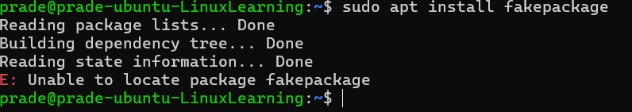

# Assignment 6: APT (Advanced Package Tool)

**Objectives:**
- Learn to install, update, remove, and search for software using APT
- Understand repository management and package dependencies
- Gain hands-on experience troubleshooting package installation issues

## Part 1: Understanding APT & System Updates

1. **Check APT version**
   ```bash
   apt --version
   ```
✅ Gain hands-on experience in troubleshooting package installation issues.<br>

**Images:**


## Explanation:
This shows the installed version of APT (Advanced Package Tool).<br>
**APT** is the package manager used in Ubuntu-based systems.

```2. Update the package list```

```bash
sudo apt update
```
Purpose:
- Downloads the latest package lists from repositories
- Refreshes metadata
- Does not install or upgrade any software

```3. Upgrade install package```

```bash
sudo apt upgrade -y
```

#### Difference between ```update``` and ```upgrade```
| Command       | What It Does               |
| ------------- | -------------------------- |
| `apt update`  | Refreshes package list     |
| `apt upgrade` | Installs available updates |


Simple: 
- ```update``` = check
- ```upgrade```= install

```4.View Pending Updates``` 
```bash
apt list --upgradable 
```
**Images:**


→ Shows all installed packages that have newer versions available.

## Second part: Installing & Managing Packages 
``1. Search for an Image Editor``

```bash
apt search image editor
```
**Selected Package:**
``gimp``

``2. View Package Details``
```bash 
apt show gimp
```

**Dependencies require:**

GIMP requires multiple system libraries and image-processing libraries such as:

- libgimp2.0t64

- gimp-data

- libc6

- libgtk2.0-0t64

- libpng16-16t64

- libjpeg8

- libtiff6

- libwebp7

- zlib1g

- graphviz

- xdg-utils

These dependencies are necessary for graphical rendering, image decoding, file format support, and system integration.

``3. Install the Package``

```bash
sudo apt install gimp -y
```
It is instlled.
**Result:** 
```bash
gimp --version
```
**GNU Image Manipulation Program version 2.10.36**

``4. Check installed package version:``

```bash
apt list --installed | grep gimp 
```
**Result:** 
```bash
gimp/noble-updates,now 2.10.36-3ubuntu0.24.04.1 amd64 [installed]
```
``Additional Installed Packages:``

The following dependencies were automatically installed:

- gimp-data

- libgimp2.0t64

These were required for GIMP to function properly.

## Third part: Removing & Cleaning Packages
``1. Remove Package ``
```bash 
sudo apt remove gimp -y
```

- This removes the program but keeps configuration files.

``2. Purge Configuration Files``
```bash 
sudo apt remove gimp -y
```
- Difference Between Remove and Purge

| Command | What It Removes               |
| ------- | ----------------------------- |
| remove  | Program files only            |
| purge   | Program + configuration files |

``3. Remove Unused Dependencies``

```bash 
sudo apt autoremove -y
```
- Why it is important?

When we install packages dependencies are added.

After removing the main package:
- Dependencies may remain unused.
- ``autoremove`` cleans them.

``4. Clean Downloaded Package Files``

```bash 
sudo apt clean
```
- ``apt clean`` deletes those cached files.
BAsically:
-It frees disk space.
- It keeps system tidy


## Fourth Part : Managing Repositories & Troubleshooting

`` 1. List APT Repositories``
```bash 
cat /etc/apt/sources.list
```
 This means that in Ubuntu 24.04 (noble), the traditional sources.list file is no longer used to manage repositories. Ubuntu now uses the newer deb822 format, where repository configurations are stored inside the /etc/apt/sources.list.d/ directory.

Therefore, repository management has shifted from the old flat text format to a more structured and modern configuration system.

``2. Add Universe Repository``

```bash
sudo add-apt-repository universe
```
“The universe repository provides access to community-maintained, open-source software that is not officially supported by Canonical. This includes additional applications, utilities, and libraries, such as GIMP, which expand the functionality of the Ubuntu system.”

``3. Simulate Installation Failure``  
```bash
sudo apt install fakepackage
```
**Error Message:**
E: Unable to locate package fakepackage
**Images:**



```How to Troubleshoot```- Check spelling:
```bash
apt search fakepackage
```
- Update package list:
```bash
sudo apt update
``` 
- Verify repositories:
```baash
cat /etc/apt/sources.list
```
- Check internet connection

# Bonus: Holding a Package

- Hold a Package
```bash
sudo apt-mark hold gimp
```
Result:
gimp set on hold.

- Unhold a Package
```bash
sudo apt-mark unhold gimp
```
**Why hold a package?**

- New version breaks compatibility
- Software has a bug
- You need a specific stable version
- Production server stability is critical
