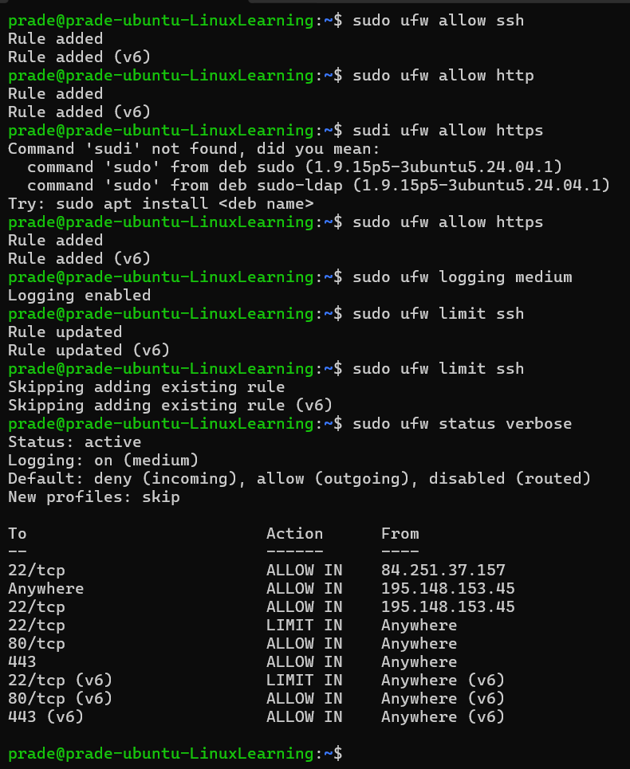

# Assignment 8 (Firewall)

For `Assignment 8` the task was to create a firewall for my server that loads when the server starts.

## Firewall 
I have use `UFW` as a host based firewall to protect the server.

### Define Policies

**Rule:**
```bash
sudo ufw default deny incoming
```

**Purpose:**

- Blocks all incoming traffic unless explicitly allowed. 

- This minimizes the attack surface of the server.

---

**Rule:**
```bash
sudo ufw default allow outgoing
```
**Purpose:**

- Allows the server to initiate outbound connections (updates, responses).
---

### Allowed Services

#### SSH (Openssh server)
**Rule:**
```bash 
sudo ufw limit ssh
```

**Purpose:**

- Allows SSH access (port 22) for remote administration.
- The "limit" option rate-limits new connections to prevent
SYN flood and brute-force attacks.

#### HTTP Server
**Rule:**
```bash
sudo ufw limit http
```
**Purpose:**

- Allows web traffic on port 80 (TCP) so users can access the web server.
#### HTTPS Server
Rule:
```bash
sudo ufw limit https
```
Purpose:
- Allows encrypted web traffic on port 443 (TCP) to ensure secure communication between clients and the server.
--- 

## Logging Configuration

**Rule:**
```bash
sudo ufw logging medium
```
**Purpose:**  
- Enables firewall logging to record both blocked packets and new connection attempts.  
- This helps in monitoring, troubleshooting, and detecting suspicious activities such as port scanning or unauthorized access attempts.

Logs are stored in:

`/var/log/ufw.log`

## SYN Flood Protection

**Rule:**
```bash
sudo ufw limit ssh
```

**Purpose:**  
- Limits the rate of incoming TCP connection attempts.  
- This helps mitigate SYN flood attacks by preventing excessive half-open TCP connections that could exhaust server resources.


## Additional Attack Mitigation

### SSH Brute Force Protection

**Rule:**
```bash
sudo ufw limit ssh
```

**Purpose:**  
- Prevents repeated login attempts from the same source IP address.  
- If too many connection attempts are detected within a short time, the firewall automatically restricts further attempts.

## Firewall Status Verification

The firewall status was verified using:

```bash
sudo ufw status verbose
```

The final configuration shows:

- Default: deny (incoming), allow (outgoing)
- SSH: LIMIT
- HTTP: ALLOW
- HTTPS: ALLOW
- Logging: enabled (medium)


**Image**
