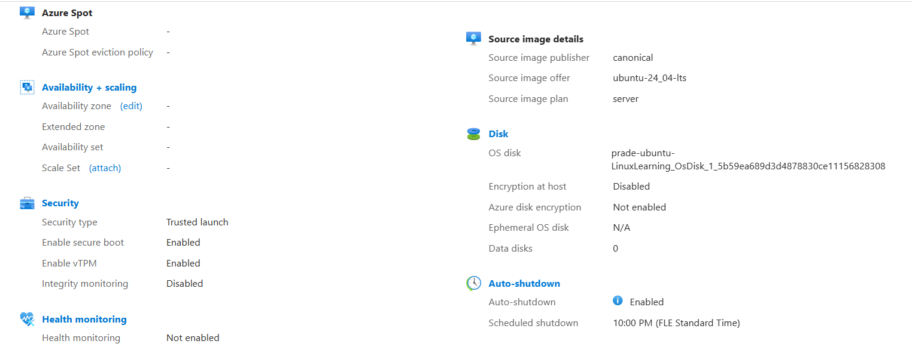

**Name:** Pradeep Sapkota

**Date:** 18 January 2026  

# Assignment No: 0

# Task 1 – Creating Ubuntu VM on Azure + SSH Connection

This is my simple documentation for setting up an Ubuntu virtual machine in Azure and connecting to it with SSH.

## Step 1: Azure Account + Free Credits

I logged in to [portal.azure.com](https://portal.azure.com) with my HAMK student email.  
Then I activated **Azure for Students** to get free credits.


## Step 2: Created Resource Group

I made a new resource group called `Linux-Management-1` in **Sweden Central**.


## Step 3: Created the Virtual Machine

Settings I used:
- Image: **Ubuntu Server 24.04 LTS**
- Size: **Standard D2s v3**
- Name: `prade-ubuntu-LinuxLearning`
- Authentication: SSH key
- Allowed SSH from my IP

After a small region issue (had to wait a bit), the VM was ready!

Here’s what the VM overview looks like:


## Step 4: Connected with SSH using PuTTY

I downloaded PuTTY from the official site.  
Took the public IP from Azure → opened PuTTY → entered IP + username + loaded my SSH key.

First login worked perfectly! Got the Ubuntu welcome message.





## Step 5: Connected to the terminal
After completing all the step I have make it so that I can run it from terminal as per professor guidance. And we have created shortcut key so that it can be open easily afterward.


# Assignment NO: 2

For this time my professor (Toni Laitinen) have given a assignment where we have to select five different **Level 2** directories and save their contents in one file, `listing.md`.  
Here **Level 2** directories means /home/name. Not /home which is **Level 1** directory.

So, I was having a problem on how to save the content in **lissting.md**, so I used **chatgpt** for that. Rest of was easy as we have to find the content which was already exist in our files.

So, here is are the code that I have used in while I was coding my asignment.

``` linux
prade@prade-ubuntu-LinuxLearning:~$ ls /
bin                home               media  run                 sys
bin.usr-is-merged  lib                mnt    sbin                tmp
boot               lib.usr-is-merged  opt    sbin.usr-is-merged  usr
dev                lib64              proc   snap                var
etc                lost+found         root   srv
prade@prade-ubuntu-LinuxLearning:~$ ls /home
mickey  pluto  prade
prade@prade-ubuntu-LinuxLearning:~$ ls /usr
bin  games  include  lib  lib64  libexec  local  sbin  share  src
prade@prade-ubuntu-LinuxLearning:~$ ls /var
backups  crash  local  log   opt  snap   tmp
cache    lib    lock   mail  run  spool
prade@prade-ubuntu-LinuxLearning:~$ ls /run
0_waagent.pid    initctl               snapd-snap.socket
agetty.reload    lock                  snapd.socket
blkid            log                   sshd
chrony           lvm                   sshd.pid
cloud-init       lxd-installer.socket  sudo
console-setup    motd.d                systemd
credentials      motd.dynamic          tmpfiles.d
crond.pid        mount                 udev
crond.reboot     multipath             udisks2
cryptsetup       multipathd.pid        unattended-upgrades.lock
dbus             needrestart           unattended-upgrades.progress
dhcpcd           screen                user
dmeventd-client  sendsigs.omit.d       utmp
dmeventd-server  setrans               uuidd
fsck             shm                   waagent.pid
prade@prade-ubuntu-LinuxLearning:~$ cd /home/prade
prade@prade-ubuntu-LinuxLearning:~$ cd /home/mickey
prade@prade-ubuntu-LinuxLearning:/home/mickey$ cd /usr/bin
prade@prade-ubuntu-LinuxLearning:/usr/bin$ cd /usr/games
prade@prade-ubuntu-LinuxLearning:/usr/games$ cd /var/log
prade@prade-ubuntu-LinuxLearning:/var/log$ cd ~
prade@prade-ubuntu-LinuxLearning:~$ mkdir listing.md
mkdir: cannot create directory ‘listing.md’: File exists
prade@prade-ubuntu-LinuxLearning:~$ > listing.md
prade@prade-ubuntu-LinuxLearning:~$ echo "## /home/prade" >> listing.md
ls /home/prade >> listing.md
echo "" >> listing.md

echo "## /home/mickey" >> listing.md
ls /home/mickey >> listing.md
echo "" >> listing.md

echo "## /usr/bin" >> listing.md
ls /usr/bin >> listing.md
echo "" >> listing.md

echo "## /usr/games" >> listing.md
ls /usr/games >> listing.md
echo "" >> listing.md

echo "## /var/log" >> listing.md
ls /var/log >> listing.md
echo "" >> listing.md
prade@prade-ubuntu-LinuxLearning:~$ ls listing.md
listing.md
prade@prade-ubuntu-LinuxLearning:~$ less listing.md
prade@prade-ubuntu-LinuxLearning:~$
```

**Results** 
```
prade@prade-ubuntu-LinuxLearning:~$ cat listing.md
## /home/prade
dfile.txt
filex.txt
lesson2
listing.md
test.txt

## /home/mickey

## /usr/bin
NF
VGAuthService
X11
[
aa-enabled
aa-exec
aa-features-abi
acpidbg
add-apt-repository
addpart
apport-bug
apport-cli
apport-collect
apport-unpack
appstreamcli
apropos
apt
apt-add-repository
apt-cache
apt-cdrom
apt-config
apt-extracttemplates
apt-ftparchive
apt-get
apt-key
apt-mark
apt-sortpkgs
arch
atobm
automat-visualize3
awk
b2sum
base32
base64
basename
basenc
bash
bashbug
bc
bitmap
bmtoa
boltctl
bpftrace
bpftrace-aotrt
btrfs
btrfs-convert
btrfs-find-root
btrfs-image
btrfs-map-logical
btrfs-select-super
btrfsck
btrfstune
busctl
busybox
byobu
byobu-config
byobu-ctrl-a
byobu-disable
byobu-disable-prompt
byobu-enable
byobu-enable-prompt
byobu-export
byobu-janitor
byobu-keybindings
byobu-launch
byobu-launcher
byobu-launcher-install
byobu-launcher-uninstall
byobu-layout
byobu-prompt
byobu-quiet
byobu-reconnect-sockets
byobu-screen
byobu-select-backend
byobu-select-profile
byobu-select-session
byobu-shell
byobu-silent
byobu-status
byobu-status-detail
byobu-tmux
byobu-ugraph
byobu-ulevel
c_rehash
captoinfo
cat
catman
cftp3
chage
chardet
chardetect
chattr
chcon
chfn
chgrp
chmod
choom
chown
chronyc
chrt
chsh
chvt
cifscreds
cifsiostat
ckbcomp
ckeygen3
cksum
clear
clear_console
cloud-id
cloud-init
cloud-init-per
cmp
codepage
col
col1
col2
col3
col4
col5
col6
col7
col8
col9
colcrt
colrm
column
comm
conch3
corelist
cp
cpan
cpan5.38-x86_64-linux-gnu
cpio
cpupower
crontab
csplit
ctail
ctstat
curl
cut
cvtsudoers
dash
date
dbus-cleanup-sockets
dbus-daemon
dbus-monitor
dbus-run-session
dbus-send
dbus-update-activation-environment
dbus-uuidgen
dbxtool
dd
deallocvt
deb-systemd-helper
deb-systemd-invoke
debconf
debconf-apt-progress
debconf-communicate
debconf-copydb
debconf-escape
debconf-set-selections
debconf-show
debian-distro-info
delpart
delv
df
dh_bash-completion
dh_installxmlcatalogs
diff
diff3
dig
dir
dircolors
dirmngr
dirmngr-client
dirname
distro-info
dmesg
dnsdomainname
do-release-upgrade
domainname
dpkg
dpkg-deb
dpkg-divert
dpkg-maintscript-helper
dpkg-query
dpkg-realpath
dpkg-split
dpkg-statoverride
dpkg-trigger
du
dumpkeys
eatmydata
ec2metadata
echo
ed
editor
efibootdump
efibootmgr
egrep
eject
enc2xs
encguess
env
envsubst
eqn
ex
expand
expiry
expr
factor
faillog
fallocate
false
fgconsole
fgrep
file
finalrd
find
findmnt
flock
fmt
fold
free
ftp
fuser
fusermount
fusermount3
fwupdmgr
fwupdtool
gapplication
gawk
gawkbug
gdbus
geqn
getcifsacl
getconf
getent
getkeycodes
getopt
gettext
gettext.sh
ginstall-info
gio
gio-querymodules
git
git-receive-pack
git-shell
git-upload-archive
git-upload-pack
glib-compile-schemas
gpasswd
gpg
gpg-agent
gpg-connect-agent
gpg-wks-client
gpgconf
gpgparsemail
gpgsm
gpgsplit
gpgtar
gpgv
gpic
grep
gresource
groff
grog
grops
grotty
groups
growpart
grub-editenv
grub-file
grub-fstest
grub-glue-efi
grub-kbdcomp
grub-menulst2cfg
grub-mkfont
grub-mkimage
grub-mklayout
grub-mknetdir
grub-mkpasswd-pbkdf2
grub-mkrelpath
grub-mkrescue
grub-mkstandalone
grub-mount
grub-ntldr-img
grub-render-label
grub-script-check
grub-syslinux2cfg
gsettings
gtbl
gunzip
gzexe
gzip
h2ph
h2xs
hardlink
hd
head
helpztags
hexdump
host
hostid
hostname
hostnamectl
htop
hwe-support-status
i386
ico
iconv
id
inetutils-telnet
info
infobrowser
infocmp
infotocap
install
install-info
instmodsh
ionice
iostat
ip
ipcmk
ipcrm
ipcs
iptables-xml
ischroot
iscsiadm
join
journalctl
jq
json-patch-jsondiff
json_pp
jsondiff
jsonpatch
jsonpointer
jsonschema
kbd_mode
kbdinfo
kbxutil
keep-one-running
kernel-install
keyctl
kill
killall
kmod
kmodsign
landscape-sysinfo
last
lastb
lastlog
lcf
ld.so
ldd
less
lessecho
lessfile
lesskey
lesspipe
lexgrog
libnetcfg
link
linux-boot-prober
linux-check-removal
linux-update-symlinks
linux-version
linux32
linux64
ln
lnstat
loadkeys
loadunimap
locale
locale-check
localectl
localedef
logger
login
loginctl
logname
look
lowntfs-3g
ls
lsattr
lsb_release
lsblk
lscpu
lshw
lsinitramfs
lsipc
lslocks
lslogins
lsmem
lsmod
lsns
lsof
lspci
lspgpot
lspower
lsscsi
lsusb
lzcat
lzcmp
lzdiff
lzegrep
lzfgrep
lzgrep
lzless
lzma
lzmainfo
lzmore
mailmail3
man
man-recode
mandb
manifest
manpath
mapscrn
markdown-it
mawk
mbim-network
mbimcli
mcookie
md5sum
md5sum.textutils
mdig
memhog
mesg
migrate-pubring-from-classic-gpg
migratepages
migspeed
mk_modmap
mkdir
mkfifo
mknod
mksquashfs
mktemp
mmcli
mokutil
more
mount
mountpoint
mpstat
mt
mt-gnu
mtr
mtr-packet
mv
namei
nano
nawk
nc
nc.openbsd
neqn
netaddr
netcat
networkctl
networkd-dispatcher
newgrp
ngettext
nice
nisdomainname
nl
nohup
nproc
nroff
nsenter
nslookup
nstat
nsupdate
ntfs-3g
ntfs-3g.probe
ntfscat
ntfscluster
ntfscmp
ntfsdecrypt
ntfsfallocate
ntfsfix
ntfsinfo
ntfsls
ntfsmove
ntfsrecover
ntfssecaudit
ntfstruncate
ntfsusermap
ntfswipe
numactl
numastat
numfmt
oclock
od
oem-getlogs
on_ac_power
openssl
openvt
os-prober
pager
partx
passwd
paste
pastebinit
patch
pathchk
pbget
pbput
pbputs
pdb3
pdb3.12
peekfd
perf
perl
perl5.38-x86_64-linux-gnu
perl5.38.2
perlbug
perldoc
perlivp
perlthanks
pgrep
pic
pico
piconv
pidof
pidstat
pidwait
pinentry
pinentry-curses
ping
ping4
ping6
pinky
pkaction
pkcheck
pkcon
pkill
pkmon
pkttyagent
pl2pm
pldd
plymouth
pmap
pod2html
pod2man
pod2text
pod2usage
podchecker
pollinate
pr
preconv
printenv
printf
prlimit
pro
prove
prtstat
ps
psfaddtable
psfgettable
psfstriptable
psfxtable
pslog
pstree
pstree.x11
ptar
ptardiff
ptargrep
ptx
purge-old-kernels
pwd
pwdx
py3clean
py3compile
py3versions
pybabel
pybabel-python3
pydoc3
pydoc3.12
pygettext3
pygettext3.12
pygmentize
pyhtmlizer3
pyserial-miniterm
pyserial-ports
python3
python3.12
pzstd
qmi-firmware-update
qmi-network
qmicli
rbash
rdma
readlink
realpath
red
rename.ul
rendercheck
renice
rescan-scsi-bus.sh
reset
resizecons
resizepart
resolvectl
rev
rgrep
rm
rmdir
rnano
routel
rrsync
rsync
rsync-ssl
rtla
rtstat
run-one
run-one-constantly
run-one-until-failure
run-one-until-success
run-parts
run-this-one
runcon
rview
rvim
sadf
sar
sar.sysstat
savelog
sbattach
sbkeysync
sbsiglist
sbsign
sbvarsign
sbverify
scalar
scandeps
scp
screen
screendump
script
scriptlive
scriptreplay
scsi_logging_level
scsi_mandat
scsi_readcap
scsi_ready
scsi_satl
scsi_start
scsi_stop
scsi_temperature
sdiff
sed
select-editor
sensible-browser
sensible-editor
sensible-pager
sensible-terminal
seq
setarch
setcifsacl
setfont
setkeycodes
setleds
setlogcons
setmetamode
setpci
setpriv
setsid
setterm
setupcon
sftp
sg
sg_bg_ctl
sg_compare_and_write
sg_copy_results
sg_dd
sg_decode_sense
sg_emc_trespass
sg_format
sg_get_config
sg_get_elem_status
sg_get_lba_status
sg_ident
sg_inq
sg_logs
sg_luns
sg_map
sg_map26
sg_modes
sg_opcodes
sg_persist
sg_prevent
sg_raw
sg_rbuf
sg_rdac
sg_read
sg_read_attr
sg_read_block_limits
sg_read_buffer
sg_read_long
sg_readcap
sg_reassign
sg_referrals
sg_rep_pip
sg_rep_zones
sg_requests
sg_reset
sg_reset_wp
sg_rmsn
sg_rtpg
sg_safte
sg_sanitize
sg_sat_identify
sg_sat_phy_event
sg_sat_read_gplog
sg_sat_set_features
sg_scan
sg_seek
sg_senddiag
sg_ses
sg_ses_microcode
sg_start
sg_stpg
sg_stream_ctl
sg_sync
sg_test_rwbuf
sg_timestamp
sg_turs
sg_unmap
sg_verify
sg_vpd
sg_wr_mode
sg_write_buffer
sg_write_long
sg_write_same
sg_write_verify
sg_write_x
sg_xcopy
sg_zone
sginfo
sgm_dd
sgp_dd
sh
sha1sum
sha224sum
sha256sum
sha384sum
sha512sum
shasum
showconsolefont
showkey
shred
shuf
skill
slabtop
sleep
slogin
smb2-quota
smbinfo
snap
snapctl
snapfuse
snice
soelim
sort
sos
sos-collector
sosreport
splain
split
splitfont
sqfscat
sqfstar
ss
ssh
ssh-add
ssh-agent
ssh-argv0
ssh-copy-id
ssh-import-id
ssh-import-id-gh
ssh-import-id-lp
ssh-keygen
ssh-keyscan
stat
static-sh
stdbuf
strace
strace-log-merge
streamzip
stty
su
sudo
sudoedit
sudoreplay
sum
sync
systemctl
systemd
systemd-ac-power
systemd-analyze
systemd-ask-password
systemd-cat
systemd-cgls
systemd-cgtop
systemd-confext
systemd-creds
systemd-cryptenroll
systemd-cryptsetup
systemd-delta
systemd-detect-virt
systemd-escape
systemd-firstboot
systemd-hwdb
systemd-id128
systemd-inhibit
systemd-machine-id-setup
systemd-mount
systemd-notify
systemd-path
systemd-repart
systemd-run
systemd-socket-activate
systemd-stdio-bridge
systemd-sysext
systemd-sysusers
systemd-tmpfiles
systemd-tty-ask-password-agent
systemd-umount
tabs
tac
tail
tapestat
tar
taskset
tbl
tclsh
tclsh8.6
tcpdump
tee
telnet
tempfile
test
tic
time
timedatectl
timeout
tkconch3
tload
tmux
tnftp
toe
top
touch
tput
tr
trace-cmd
tracepath
transset
trial3
troff
true
truncate
tset
tsort
tty
turbostat
twist3
twistd3
tzselect
ua
ubuntu-advantage
ubuntu-bug
ubuntu-distro-info
ubuntu-security-status
ucf
ucfq
ucfr
uclampset
udevadm
udisksctl
ul
umount
uname
unattended-upgrade
unattended-upgrades
uncompress
unexpand
unicode_start
unicode_stop
uniq
unlink
unlzma
unmkinitramfs
unshare
unsquashfs
unxz
unzstd
update-alternatives
update-mime-database
uptime
usb-devices
usbhid-dump
usbip
usbipd
usbreset
users
utmpdump
uuidgen
uuidparse
varlinkctl
vcs-run
vdir
vi
view
vigpg
vim
vim.basic
vim.tiny
vimdiff
vimtutor
vm-support
vmhgfs-fuse
vmstat
vmtoolsd
vmware-alias-import
vmware-checkvm
vmware-hgfsclient
vmware-namespace-cmd
vmware-rpctool
vmware-toolbox-cmd
vmware-vgauth-cmd
vmware-vmblock-fuse
vmware-xferlogs
w
wall
watch
watchgnupg
wc
wdctl
wget
whatis
whereis
which
which.debianutils
whiptail
who
whoami
wifi-status
write
x11perf
x11perfcomp
x86_64
x86_energy_perf_policy
xargs
xauth
xbiff
xcalc
xclipboard
xclock
xconsole
xcursorgen
xcutsel
xdg-user-dir
xdg-user-dirs-update
xditview
xedit
xeyes
xgc
xload
xlogo
xmag
xman
xmore
xsubpp
xwd
xwud
xxd
xz
xzcat
xzcmp
xzdiff
xzegrep
xzfgrep
xzgrep
xzless
xzmore
yes
ypdomainname
zcat
zcmp
zdiff
zdump
zegrep
zfgrep
zforce
zgrep
zipdetails
zless
zmore
znew
zstd
zstdcat
zstdgrep
zstdless
zstdmt

## /usr/games

## /var/log
README
apport.log
apt
auth.log
auth.log.1
azure
btmp
chrony
cloud-init-output.log
cloud-init.log
dist-upgrade
dmesg
dmesg.0
dmesg.1.gz
dmesg.2.gz
dpkg.log
journal
kern.log
kern.log.1
landscape
lastlog
private
syslog
syslog.1
sysstat
ubuntu-advantage-apt-hook.log
unattended-upgrades
waagent.log
wtmp
```
And the image of this:


# Assigment 3
For `Assignment 3` the task was to create users and use created users to test out file access permissions.

## Step 1: Create the Tupu user using the `adduser` script.
In this step, we were told just to use ``adduser`` script and add user tupu.

```bash
sudo adduser tupu
```
**Image**


## Step 2: Create the Lupu user using the ``useradd`` command. Try to create a user profile, home directory, and user group similar to Tupu.
In this step, we were told to create ``lupu`` user using ``useradd`` command.

But, I was having a problem on creating a ``-G lupu lupu`` because -G is a secondary group and it always shows the problem: 
```
useradd: group 'lupu' does not exist
```
So thats why I use ``-g`` because it is a primary group and I have already add lupu in a group. 

```bash
sudo groupadd lupu
```
```bash
sudo useradd -m -d /home/lupu -s /bin/bash -g lupu lupu
```

**Image**


## Step 3: Create the Hupu system user with the login shell set to ``/bin/false``.

In this step, we were told to create a hupu system using ``/bin/false``.

```bash
sudo useradd --system --shell /bin/false hupu
```
**Image**


## Step 4: Add the users Tupu and Lupu to the sudo users.
In this we have given two option to add the users accordingly.
First one: 
```bash
sudo visudo
```
After this:
```
Add the following lines:
tupu ALL=(ALL:ALL) ALL
lupu ALL=(ALL:ALL) ALL
```
Second one:
```bash
sudo usermod -aG sudo tupu
sudo usermod -aG sudo lupu
```
So, I have done this step by using the second solution.

**Images**


## Step 5: Create a directory ``/opt/projekti`` and add both users (Tupu and Lupu) as owners. Only Tupu and Lupu should have access to list files in the directory, read, and modify them.

At first, I created a common group for both of the user.
```bash
sudo groupadd projekti
```
And added both users to the group:
```bash
sudo usermod -aG projekti tupu
sudo usermod -aG projekti lupu
```
After doing this, I created the projekti directory:
```bash
sudo mkdir /opt/projekti
```
Then, I assign group ownership:
```bash
sudo chown root:projekti /opt/projekti
```
After doing so, I set the directory permissions.
```bash
sudo chmod 770 /opt/projekti
```
With this:
- Owner and Groups can read, write, execute.
-Others they have no access.

After this, setgid bit ensures all newly created files and directories inherit the ``projekti`` group.
```bash
sudo chmod g+s /opt/projekti
```

**Images**


## Step 6: Premisssion Testing
I was a bit curious about it works or not so I run a testing program too.

- Test as ``tupu``
```bash
su - tupu
cd /opt/projekti
touch test_tupup.txt
ls -l
```
**Image**


- Test as ``lupu``
```bash
su - lupu
cd /opt/projekti
echo "hello" >> test_tupu.txt
touch test_lupu.txt
ls -l
```
**Images**


- Test as ``hupu``

Here hupu is a unauthorized access so it should so access denied.

```bash
su - hupu
cd /opy/projekti
```

**Images**


So as we can see, for ``tupu`` and ``lupu`` it allow the access but for ``hupu`` it denies it which shows that our assignment is correct.

# Conclusion
This task help me to learn how the linux user and permission management using users, groups, sudo access, and directory permission control.